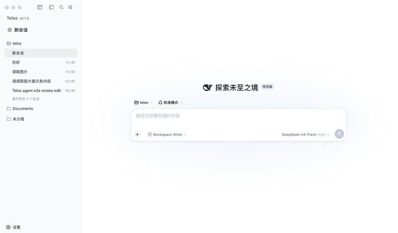
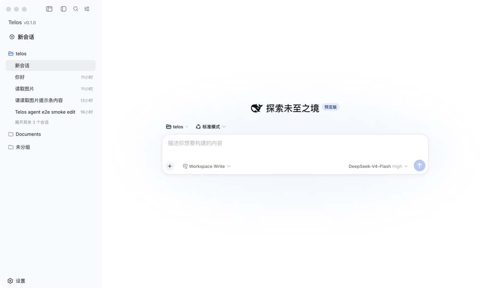
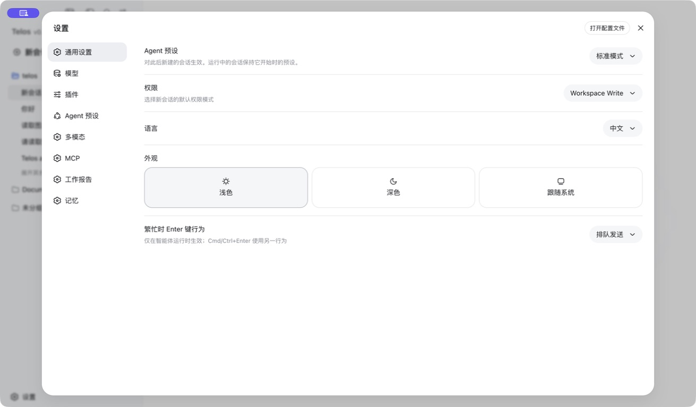
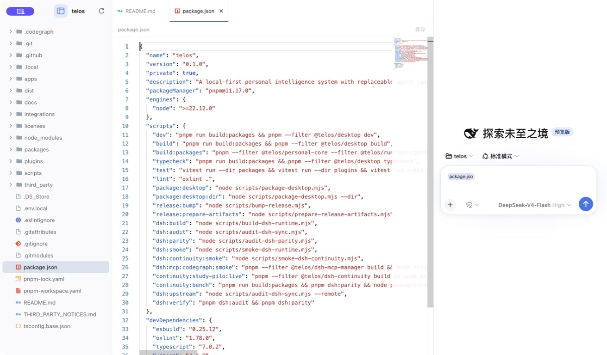

# Telos

**本地优先、持续存在、可审查的个人智能系统。**

Telos 面向的是一个人长期使用的 AI，而不是一次性问答。它保留完全自由的聊天、会话和工作区，同时把长期记忆、多模态理解、文件编辑、工具调用、任务恢复与权限控制放在对话背后。

<p align="center">
  
</p>

<p align="center">
  <a href="https://github.com/codexiaoke/telos/releases">下载预览版</a>
  ·
  <a href="#快速开始">从源码运行</a>
  ·
  <a href="./docs/architecture/0003-full-dsh-web-baseline.md">架构决策</a>
  ·
  <a href="./docs/maintenance/dsh-upstream-sync.md">DSH 同步规范</a>
</p>

> [!IMPORTANT]
> Telos 仍处于 Preview 阶段。当前版本已经具备可运行的桌面产品、连续记忆、图片理解、编辑工作台、MCP 管理和跨平台打包，但完整目标系统、音视频理解、电脑操作与更多 Runtime 仍在建设中。

## 为什么做 Telos

大多数 AI 产品在新会话里重新认识你，或者把历史聊天简单塞回上下文。Telos 希望建立的是另一种关系：

```text
自由对话
  + 可见、可纠正、可删除的个人状态
  + 可替换的 Agent Runtime 与模型
  + 有权限、有记录、可撤销的现实行动
  = 能跨会话、跨模型、跨时间持续协作的个人智能
```

它最终需要知道你正在做什么、想完成什么、已经做过哪些决定，以及哪些事情可以代你执行；同时，所有重要记忆与动作都应当能够被用户检查和控制。

## Telos 的特点

### 自由聊天仍是第一界面

Telos 不是固定流程工作台。你可以像使用个人聊天 AI 一样自由创建会话和工作区；记忆、工具、文件与任务状态在需要时进入对话，而不是强迫用户先选择一个“工作流”。

### 记忆不是聊天记录

连续记忆使用本地 SQLite 事实源，区分来源、作用域、候选、确认、纠正、召回和删除。用户可以查看模型记住了什么、为什么召回、如何修正，以及删除是否完整。

### 文本模型也能理解图片

原生多模态模型直接接收图片。当前会话模型不支持图片时，Telos 可以调用设置中的默认多模态模型生成视觉观察，再由原会话模型继续回答、推理和调用工具。该路径由 Telos Runtime 负责，不依赖 MCP 兜底。

### 对话与真实文件修改闭环

编辑工作台提供文件树、Monaco 编辑器和持续保留的 Agent 会话。当前文件或选区可作为隐藏上下文发送给 Agent；写盘后显示 Diff，并支持接受、拒绝、撤销以及未保存内容与外部变化冲突处理。

### Runtime 可替换，产品状态不外包

DeepSeek Harness（DSH）是当前第一个完整 Agent Runtime，负责会话、投影、工具循环和插件运行。个人记忆、目标、权限、连续性与桌面产品界面归 Telos 所有，未来可以接入其他模型和 Runtime。

### 本地优先且行为可审计

个人状态、工作区上下文、报告和执行记录优先保存在本地。高风险或对外动作需要明确权限；凭据不会写入记忆或普通配置文件；文件变化和召回结果保留可检查证据。

## 当前已经可以做什么

| 能力 | 状态 | 当前实现 |
| --- | --- | --- |
| 自由聊天、会话与工作区 | 可用 | 保留完整 DSH Session、Workspace、模型选择、Agent 预设与活动能力 |
| Telos 桌面界面 | 可用 | Electron + React，自有三栏布局、设置中心、系统托盘和单实例生命周期 |
| 连续记忆 | 可用 | 本地事实源、候选确认、来源、作用域、关系投影、纠正、召回回执和删除报告 |
| 图片多模态 | 可用 | 原生图片模型直通；文本模型通过默认多模态模型完成视觉理解 |
| 模型配置 | 可用 | Provider、模型目录、默认会话模型与默认多模态模型均可在设置中配置 |
| 编辑工作台 | 可用 | 文件树、Monaco、搜索替换、标签页、文件图标、选区上下文、Diff 与撤销 |
| MCP 管理 | 基础可用 | 本地配置、启停与原始信息管理，并通过本地 CodeGraph MCP 完成验证 |
| 工作报告 | 基础可用 | 本地 Markdown 报告、规范与历史读取；邮件发送经过 DSH 工具审批 |
| DSH 插件与升级边界 | 可用 | 固定源码版本、Submodule、来源记录、parity/provenance 门禁和 overlay 适配 |
| 桌面发行 | 已验证 | macOS Apple Silicon、macOS Intel、Windows x64；GitHub Actions 自动创建草稿 Release |

“可用”表示能力已经进入真实桌面链路并有针对性测试或冒烟验证，不代表 Preview 版本已经满足所有生产环境要求。

## 界面预览

<table>
  <tr>
    <td width="50%" align="center">
      
      <br /><sub>自由聊天、会话与工作区</sub>
    </td>
    <td width="50%" align="center">
      
      <br /><sub>模型、插件、多模态、MCP、报告与记忆设置</sub>
    </td>
  </tr>
  <tr>
    <td colspan="2" align="center">
      
      <br /><sub>文件树 + Monaco + 持续保留的 Agent 会话</sub>
    </td>
  </tr>
</table>

## 后续会加入什么

路线图以能力边界为准，不承诺具体发布时间。

### 更完整的个人智能

- 目标、承诺、项目、知识与长期记忆之间的可追溯领域关系；
- 跨天任务暂停、恢复、重试、检查点、提醒和行动收据；
- 更好的记忆形成、冲突发现、时间衰减、主动召回与用户校正体验；
- 在更换模型或 Runtime 后仍能延续个人状态和任务进度。

### 完整多模态

- 音频、语音、视频、PDF 与常见文档的统一内容契约；
- 视觉、听觉和文档观察的流式进度、缓存、引用与审计；
- 多模型能力目录，以及按质量、速度、隐私和成本进行路由；
- 图片、音频、视频与文档生成结果的统一展示和持久化。

### 受控电脑操作

- 基于屏幕视觉和可访问性树理解当前电脑状态；
- 鼠标、键盘、浏览器、终端和桌面应用操作；
- 操作前预览、敏感动作确认、最小权限、撤销与执行回放；
- OpenCLI、连接器与本地工具进入同一权限和审计体系。

### 产品与生态

- 全新的主题、动效和 Agent 运行状态反馈；
- 普通模式与开发者模式分层，隐藏 Runtime 日志、原始工具参数和调试轨迹；
- 更多可替换 Runtime、模型 Provider、MCP 服务与连接器；
- 浏览器、移动端、语音入口和跨设备连续性；
- 更稳定的插件 API、兼容性测试与 DSH 上游同步自动化。

## 系统边界

```text
Desktop / Browser / IDE / Mobile / Voice
                 │
                 ▼
       Telos Personal Core
 goals / memory / knowledge / policy / receipts
                 │
                 ▼
       Runtime & capability contracts
                 │
        ┌────────┴────────┐
        ▼                 ▼
 DeepSeek Harness    future runtimes
        │
        ▼
 models / files / terminal / browser / connectors
```

| Telos 自己维护 | Runtime 或能力提供方维护 |
| --- | --- |
| 个人目标、记忆、知识、权限和连续性 | 模型推理、工具循环和专业 Agent 执行 |
| 桌面生命周期与产品界面 | DSH Host、Session、Projection 和默认插件 |
| 长期任务状态、操作收据和审计 | OpenCLI、MCP、连接器等具体能力 |
| Runtime 契约和升级兼容边界 | 可替换模型、Runtime 和外部服务实现 |

普通 Telos 功能不得直接修改 `third_party/deepseek-harness`。DSH 通过固定提交的 Submodule 从源码构建，Telos 通过稳定适配层和 overlay 接入，避免成为不可维护的 DSH WebUI Fork。

## 快速开始

### 环境要求

- macOS 或 Windows；当前发行目标不包含 Linux；
- Node.js `^22.19.0` 或 `>=24.0.0`；
- Corepack 和仓库固定的 pnpm `11.17.0`；
- 至少一个兼容模型 Provider 的 API Key。

### 获取源码与依赖

```bash
git clone --recurse-submodules https://github.com/codexiaoke/telos.git
cd telos
corepack enable
pnpm install --frozen-lockfile
pnpm dsh:build
```

已有仓库需要先恢复固定的 DSH Submodule：

```bash
git submodule update --init --recursive
```

### 配置模型

启动后可以在“设置 → 模型”中配置 Provider、API 地址、API Key 和模型；图片路由模型位于“设置 → 多模态”。开发环境也可以在仓库根目录使用不会提交的 `.env.local`：

```dotenv
DEEPSEEK_API_KEY=your_local_key
```

不要把真实密钥写入 README、源码、Git 提交或截图。

### 启动桌面端

```bash
pnpm dev
```

Electron 会启动本地 DSH Web Runtime，等待健康检查通过，再把窗口交接给 Telos 工作台。

## 下载与发布

GitHub Actions 使用原生 Runner 构建免费的无商业签名社区版：

| 平台 | 架构 | 产物 |
| --- | --- | --- |
| macOS | Apple Silicon、Intel | DMG、ZIP、更新元数据和 blockmap |
| Windows | x64 | 完整离线 NSIS 安装包、更新元数据和 blockmap |

- 手动运行 Workflow 只生成 CI Artifact；
- 推送 `vX.Y.Z` 标签会创建或更新草稿 Release；
- 草稿经过人工检查后才会公开给用户；
- Release 包含 `SHA256SUMS.txt` 用于核对完整性；
- 当前社区版不使用付费代码签名：macOS 首次打开需要在“隐私与安全性”中批准，Windows 可能显示“未知发布者”；
- 当前不构建 Linux 安装包。

更新版本前先同步根包和桌面应用版本：

```bash
pnpm release:bump 0.2.0
```

详细边界见 [Desktop distribution and lifecycle](./docs/architecture/0005-desktop-distribution-and-lifecycle.md)。

## 验证仓库

```bash
pnpm typecheck
pnpm test
pnpm lint
pnpm dsh:verify
```

其他重要验收命令：

```bash
pnpm dsh:continuity:smoke       # 真实 DSH Web + Chromium 连续记忆闭环
pnpm continuity:bench           # 12 个确定性连续性场景
pnpm dsh:mcp:codegraph:smoke    # 本地 CodeGraph MCP 链路
pnpm package:desktop:dir        # 目录包与包内 DSH Runtime 冒烟
pnpm package:desktop            # 当前平台安装包
pnpm dsh:upstream               # 只读检查 DSH 上游状态
```

`pnpm dsh:verify` 会校验 Submodule 提交、DSH 未说明修改、派生 UI 来源与许可证、默认 Web 插件 parity 以及 Telos 兼容包解析结果。

## 仓库结构

```text
apps/desktop/                    Electron 主进程、Preload 与 Telos Renderer
packages/personal-core/          连续记忆事实源与召回策略
packages/runtime-contracts/      稳定 Runtime 契约
packages/runtime-dsh/            DSH Headless Adapter
packages/continuity-bench/       连续性量化验收

plugins/dsh-continuity/          连续记忆 Host / Client 插件
plugins/dsh-multimodal/          图片路由与多模态设置
plugins/dsh-mcp-manager/         MCP 管理
plugins/dsh-workbench-files/     编辑工作台文件能力
plugins/dsh-work-report/         本地工作报告

integrations/dsh/                Telos 自有 DSH 兼容 UI、Profile 与来源记录
third_party/deepseek-harness/    固定源码版本的 DSH Submodule
docs/                            架构、维护、测试与 README 资源
scripts/                         构建、审计、打包与发布脚本
```

## 安全与隐私

- 用户数据、运行历史和个人状态优先保存在本地；
- 凭据和密钥在记忆写入边界被拒绝；
- 记忆具有来源、作用域、版本、纠正和删除能力；
- 文件修改提供 Diff、接受、拒绝、撤销与冲突提示；
- DSH Web 只由桌面端在 `127.0.0.1` 临时端口启动；
- Renderer 使用 Context Isolation、Sandbox，并禁止直接 Node.js 访问；
- 高风险、不可逆或对外提交的动作必须进入明确权限和确认边界。

安全问题请不要先创建包含利用细节的公开 Issue，可通过 [GitHub Security Advisory](https://github.com/codexiaoke/telos/security/advisories/new) 私下报告。

## 文档导航

- [Desktop foundation](./docs/architecture/0001-foundation.md)
- [DSH source integration](./docs/architecture/0002-dsh-source-integration.md)
- [Complete DSH Web baseline](./docs/architecture/0003-full-dsh-web-baseline.md)
- [Telos-owned Renderer](./docs/architecture/0004-telos-owned-renderer.md)
- [Desktop distribution and lifecycle](./docs/architecture/0005-desktop-distribution-and-lifecycle.md)
- [Multimodal runtime](./docs/architecture/0007-multimodal-runtime.md)
- [Work report plugin](./docs/architecture/0007-dsh-work-report-plugin.md)
- [DSH upstream synchronization](./docs/maintenance/dsh-upstream-sync.md)
- [Third-party notices](./THIRD_PARTY_NOTICES.md)

## 参与开发

1. 先判断功能属于 Telos 产品层、DSH Runtime 层还是外部能力层；
2. 不要为了修改产品 UI 直接编辑 DSH Submodule；
3. 一个提交只解决一个可回退的问题；
4. 提交前运行类型检查、测试、Lint 和 DSH 审计；
5. 不提交 API Key、用户数据、`.env.local`、构建产物或本地运行目录。

欢迎围绕个人连续性、多模态、Runtime 适配、隐私、安全、桌面体验和文档提交 Issue 或 Pull Request。

## License

Telos 自有代码计划开源，但仓库根目录尚未确定最终开源许可证。在正式添加 `LICENSE` 前，请不要默认 Telos 自有代码可以被重新分发。DSH、Node.js、UI 派生实现及其他依赖的许可信息见 [THIRD_PARTY_NOTICES.md](./THIRD_PARTY_NOTICES.md)。
